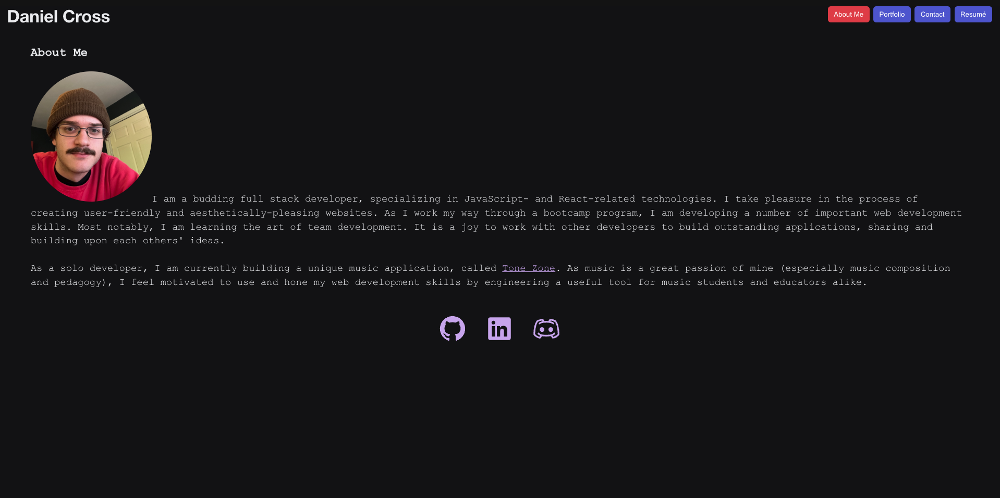
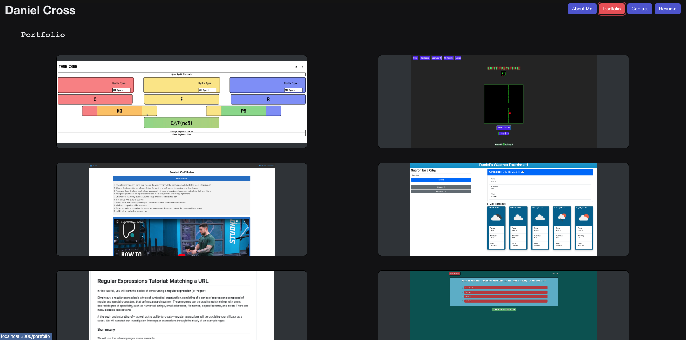
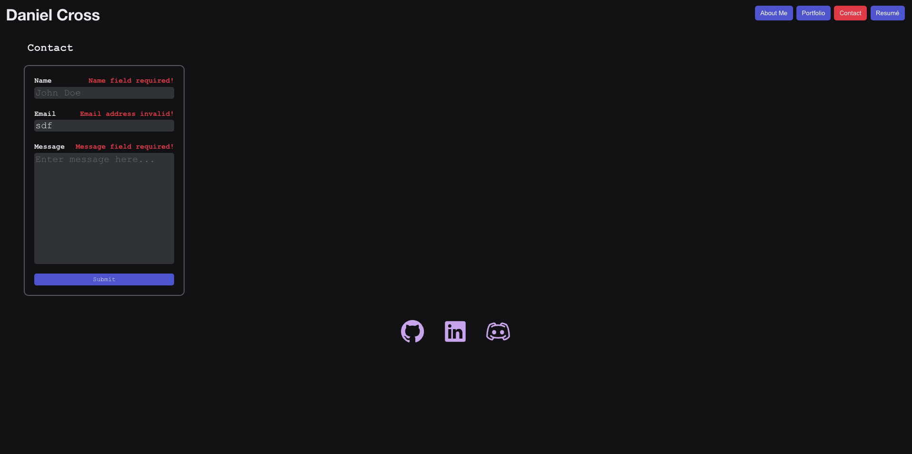

# Daniel Cross

## 

## Description

This is a simple, React-based personal portfolio website. With React's dynamic rendering capabilities, I was able to easily construct a website that both looks nice, and responds seamlessly to user interactions and input. Additionally, I leveraged the Radix UI library to give my site a dark theme, a color-theme, icons, and nice buttons.

The site features an 'About', 'Portfolio', 'Contact', and a 'Resumé page. The 'About' page is the landing page, the '/' route. Each page exists on a different route, managed by the React Router, and can be navigated to via nav-bar buttons. The page buttons are purple, except for the button corresponding to the current page, which is red. The footer of the page contains 3 icons, each of which link to a different site-- my GitHub profile, my LinkedIn profile, and my Discord server.

The 'About' page features a profile image of myself, as well as a short description about myself; the 'Portfolio' page features 6 of my projects, with links to both the deployed site, and its GitHub repository; the 'Contact' page features a form with which a user may submit their name, email, and a message. Each field will give an error if it is left blank when clicked away from. The 'email' field will also give an error when an invalid email address is entered. And lastly, the 'Resumé' page features a downloadable link for a PDF of my Resumé, as well as lists of my front- and back-end proficiencies.

### Technologies

- React
- React Router
- Radix UI
- Netlify
- GitHub
- JavaScript, HTML, CSS

### Skills/Concepts

- Use React to create a dynamic user interface, blending the use of JS, HTML, and CSS
- Use React router to set up routes to different pages on the site
- Use Radix UI library to enhance the UI of the site
- Use Netlify to build/deploy the site

## Table of Contents

- [Installation](#installation)
- [Usage](#usage)
- [Contributions](#contributions)
- [License](#license)

## Installation

Visit the GitHub repo here: https://github.com/danrcross/daniel-cross-portfolio

Visit the deployed site here: https://jocular-brigadeiros-5446f2.netlify.app/

## Usage

## License

This application is covered under the [MIT](https://opensource.org/licenses/MIT) license.

## Contributions

Radix UI Library: https://www.radix-ui.com/

- Credits for library and documentation

React Library: https://react.dev/

- Credits for library and documentation

## Tests

No tests used for the development of this app!

## Questions

Any Questions? Click a link below to visit my GitHub and/or email me!

For emails, please use this format in the subject line: 'GitHub: {NAME_OF_REPOSITORY}'

[GitHub](https://github.com/danrcross)

[Email](mailto:danrcross@gmail.com)
